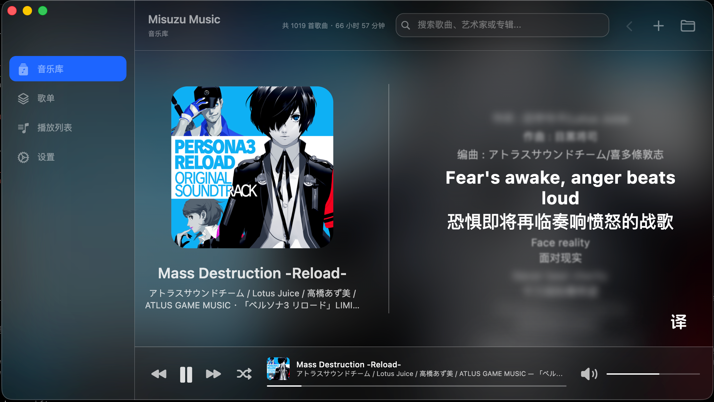
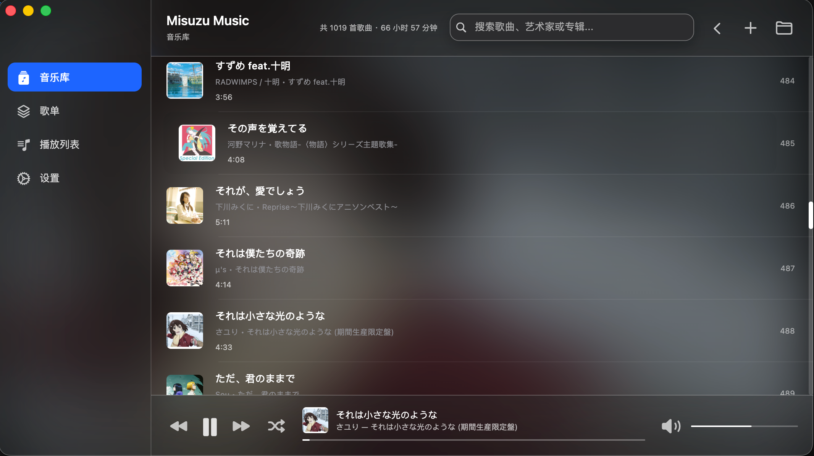
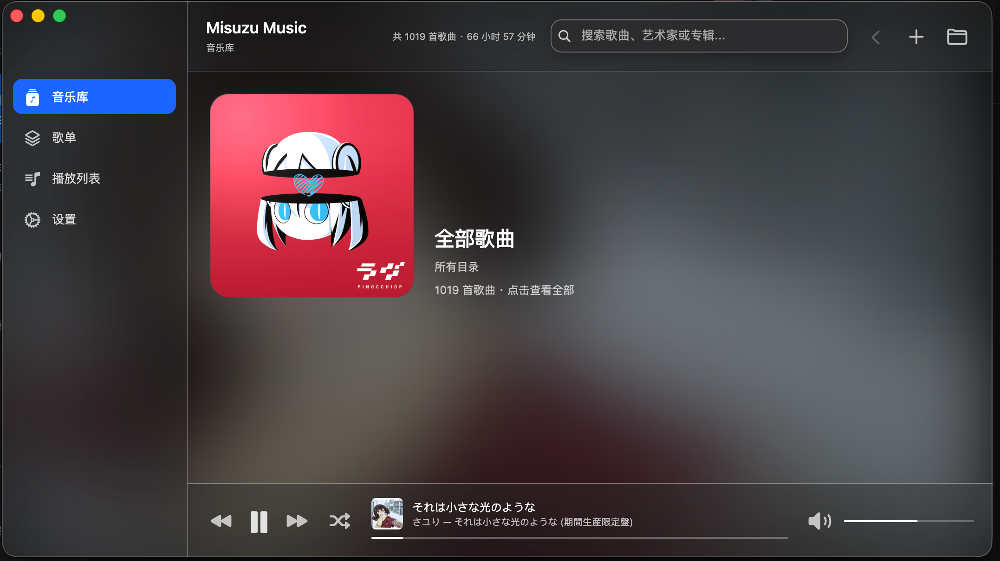

# Misuzu Music

一个本地音乐播放器。

## 下载

- Windows / Linux / macOS：从 [GitHub Release ](https://github.com/MCDFsteve/MisuzuMusic/releases/) 下载对应安装包。
- iOS：在 [App Store](https://apps.apple.com/us/app/misuzu-music/id6755328428?l=zh-Hans-CN) 获取 Misuzu Music。

## 功能：

- 导入本地音乐
- 允许创建歌单
- 允许加载本地歌词lrc文件
- 支持显示日语汉字的假名注音
- 支持对没有歌词和封面海报的音乐自动联网获取歌词和封面海报
- 轻量
- 跨平台
- 仿Apple Music设计风格
- 桌面歌词
  
  ## 图片展示
  
  
  
  
